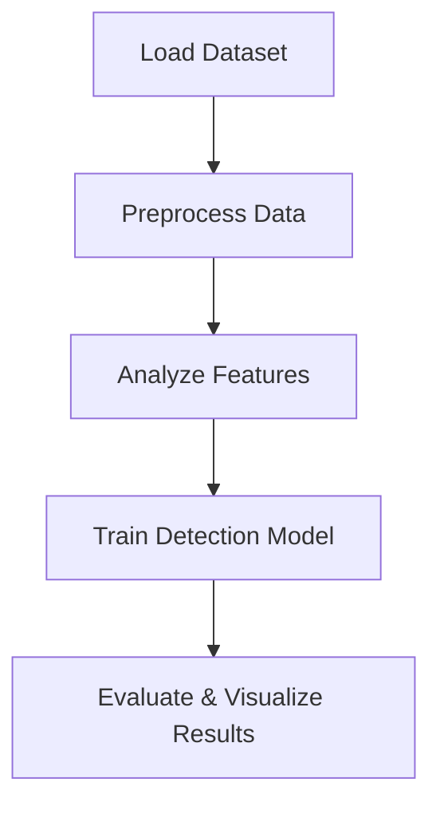

# 🚀 Synthetic Nebula

[](https://www.python.org/)
[](LICENSE)
[](https://github.com/Mrityunjya/Synthetic_Nebula/stargazers)

**Synthetic Nebula** is a Python project for detecting and analyzing synthetic datasets with modular, reproducible experiments.

---

## 🗂️ Project Structure

E:/Nebula/
│
├─ app.py # Main Python application
├─ Synthesis.ipynb # Jupyter Notebook experiments
├─ requirements.txt # Dependencies
├─ .gitignore # Ignored files, including datasets
└─ README.md # Project documentation

yaml
Copy code

> **Note:** `creditcard.csv` dataset is excluded due to GitHub size limits (>100MB). Download separately to run experiments.

---

## 🧩 Workflow


⚡ Features
Modular Python scripts for synthetic data analysis

Interactive Jupyter Notebook for experiments

Lightweight repo with reproducible results

Large datasets handled locally

🛠️ Installation
```
bash

git clone https://github.com/Mrityunjya/Synthetic_Nebula.git
cd Synthetic_Nebula
python -m venv venv        # Create virtual environment
source venv/bin/activate   # Linux/Mac
venv\Scripts\activate      # Windows
pip install -r requirements.txt
```
🚀 Usage
Run main application:
```
bash
python app.py
Open Notebook for experiments:
```
bash```
jupyter notebook Synthesis.ipynb```
📁 Dataset
creditcard.csv is not included. Download it from Kaggle and place it in the project root.

🌟 Author
Mrityunjya Sankar
GitHub: https://github.com/Mrityunjya

📜 License
Open-source under MIT License
